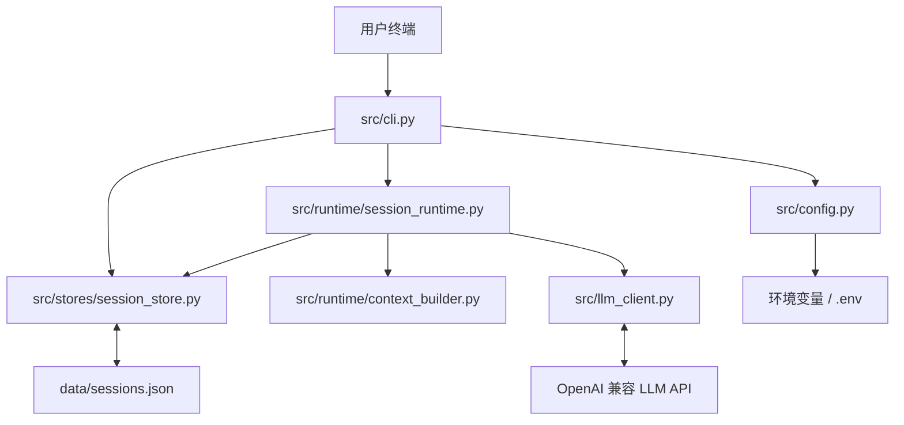
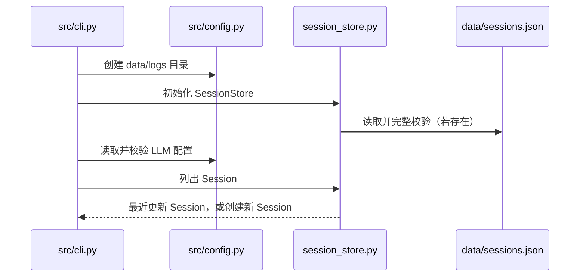
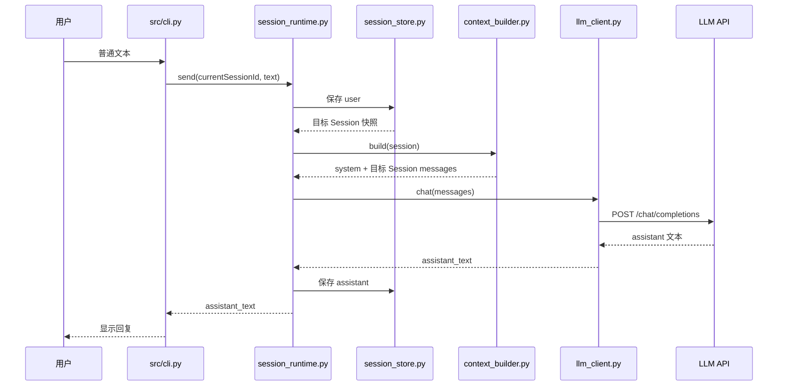

# SJTUClaw 项目结构与文件关系

本文档描述项目在 **Step 2** 完成后的真实结构。它面向希望按文件逐步阅读代码的学习者，重点回答两个问题：每个文件负责什么，以及一次操作会依次经过哪些文件。

维护要求：每完成一个 Step，或者增删、移动、重命名文件时，必须同步更新本文档中的版本状态、目录树、文件职责、依赖关系、数据流和测试映射。运行时生成的缓存、日志和用户数据只说明类别，不逐个记录临时文件。

## 当前目录树

```text
SJTUClaw/
├── .env.example
├── .gitignore
├── pyproject.toml
├── README.md
├── SJTUClaw.md
├── PROJECT_STRUCTURE.md
├── data/
│   └── .gitkeep
├── logs/
│   └── .gitkeep
├── src/
│   ├── __init__.py
│   ├── cli.py
│   ├── config.py
│   ├── conversation.py
│   ├── llm_client.py
│   ├── runtime/
│   │   ├── __init__.py
│   │   ├── context_builder.py
│   │   └── session_runtime.py
│   └── stores/
│       ├── __init__.py
│       └── session_store.py
└── tests/
    ├── test_cli.py
    ├── test_config.py
    ├── test_context_builder.py
    ├── test_conversation.py
    ├── test_llm_client.py
    ├── test_session_runtime.py
    └── test_session_store.py
```

实际运行后还可能出现 `.env`、`data/sessions.json`、`logs/sjtuclaw.log`、`__pycache__/`、`.pytest_cache/` 和 `*.egg-info/`。它们是密钥、用户数据、日志、缓存或安装元数据，已由 `.gitignore` 排除，不属于应提交的源码。

## 整体关系



这里最重要的边界是：CLI 不直接拼模型上下文，也不直接读写 JSON；Runtime 不解析终端命令；Context Builder 不调用模型或保存数据；LLM Client 不管理 Session；Session Store 不知道模型和终端的存在。

## 根目录文件

| 文件 | 作用 | 与其他文件的关系 |
|---|---|---|
| `.env.example` | 提供 `LLM_API_KEY`、`LLM_BASE_URL`、`LLM_MODEL` 的无敏感信息配置模板。 | 用户复制为 `.env`；`src/config.py` 在启动时读取同名配置。 |
| `.gitignore` | 阻止密钥、Session 数据、日志、缓存和安装产物进入版本控制。 | 保护 `.env`、`data/`、`logs/` 以及 Python 生成文件。 |
| `pyproject.toml` | 声明 Python 版本、运行依赖 `httpx`、开发依赖 `pytest` 和测试配置。 | `python -m pip install -e ".[dev]"` 根据它安装项目；pytest 根据它发现 `tests/`。 |
| `README.md` | 面向使用者说明安装、配置、启动、CLI 命令、数据位置和测试方法。 | 每个 Step 完成后同步更新；链接到本文档以解释内部结构。 |
| `SJTUClaw.md` | 项目的分步实现规格和长期质量规则，是各 Step 的验收依据。 | 后续实现必须先读取对应 Step；其中已规定持续维护本文档。 |
| `PROJECT_STRUCTURE.md` | 解释当前文件职责、依赖边界、运行数据流和测试映射。 | 随源码结构和每个 Step 实时更新，不承担运行逻辑。 |

## 运行数据目录

| 路径 | 作用 | 与其他文件的关系 |
|---|---|---|
| `data/.gitkeep` | 让空的运行数据目录可以保留在项目结构中。 | `src/config.py` 会确保目录存在；`SessionStore` 默认在这里生成 `sessions.json`。 |
| `data/sessions.json` | 运行后生成，保存版本号和全部 Session。每个 Session 包含 ID、标题、消息、创建时间和更新时间。 | 只能由 `src/stores/session_store.py` 读写；CLI 和 Runtime 不直接操作该文件。 |
| `logs/.gitkeep` | 让空的日志目录可以保留在项目结构中。 | `src/config.py` 会确保目录存在。 |
| `logs/sjtuclaw.log` | 运行后生成，记录启动、命令和模型调用错误，不记录 API Key。 | 由 `src/cli.py` 初始化的 Python logging 写入。 |

## 应用源码

### `src/__init__.py`

把 `src` 标记为 Python 包，使 `python -m src.cli` 和测试中的 `from src...` 导入能够工作。它不包含业务逻辑。

### `src/config.py`

负责读取 `.env` 与环境变量、确定环境变量优先级、校验 Key、HTTP(S) Base URL 和模型名，并创建 `data/`、`logs/` 目录。它返回不可变的 `Settings`，供 `src/cli.py` 创建 `LLMClient`。

它不发送 HTTP 请求，也不读取 Session JSON。

### `src/llm_client.py`

负责模型 HTTP 边界：校验 `system`、`user`、`assistant` 消息，向 `{LLM_BASE_URL}/chat/completions` 发送请求，并解析首个 assistant 文本。它把超时、网络失败、非 2xx、非法 JSON 和异常响应结构转换为项目自己的错误类型。

它从 `Settings` 获得模型配置，由 `SessionRuntime` 调用，但不知道 Session ID、标题和持久化文件。

### `src/conversation.py`

这是 Step 1 保留的教学实现，展示单个进程内对话如何保存完整历史。Step 2 的 CLI 已不再使用它，当前持久化对话由 `SessionRuntime + SessionStore` 负责。

保留该文件是为了让学习者比较“纯内存单 Session”和“持久化多 Session”的演进过程；`tests/test_conversation.py` 继续验证它没有退化。

### `src/stores/__init__.py`

把 `stores` 标记为 Python 子包，并声明持久化逻辑集中在 Store 层。当前没有业务代码。

### `src/stores/session_store.py`

定义 `Session` 数据模型以及 `SessionStore`。它负责：

- 生成 UUID Session ID 和严格递增的 UTC 更新时间，避免 Windows 时钟分辨率造成“最近 Session”排序不稳定；
- 校验标题、消息、时间及磁盘 JSON 结构；
- 创建、列出、查询、追加消息、重命名和删除 Session；
- 读取 `data/sessions.json` 并在重启后恢复；
- 先写同目录临时文件、刷盘，再用 `os.replace` 原子替换正式文件；
- 在 JSON 损坏或读写失败时明确报错，不静默覆盖。

`src/cli.py` 使用它执行 Session 命令，`SessionRuntime` 使用它持久化每轮消息，`ContextBuilder` 接收它返回的 `Session` 快照。

### `src/runtime/__init__.py`

把 `runtime` 标记为 Python 子包。Runtime 层负责协调已有组件，但不取代 Store、Builder 或 Client 各自的职责。

### `src/runtime/context_builder.py`

负责把固定 system 指令放在第一条，再复制目标 Session 的 `user/assistant` 消息。它刻意排除 `sessionId`、标题、创建时间和更新时间，使“磁盘保存结构”和“模型输入结构”分离。

它接收 `SessionStore` 返回的 `Session`，构造结果交给 `SessionRuntime`，自己不访问磁盘和网络。

### `src/runtime/session_runtime.py`

负责一轮普通对话的数据流：先通过 Store 保存 user 消息，再让 Context Builder 组装目标 Session 上下文，然后调用 LLM Client，最后仅在获得有效回复后保存 assistant 消息。

它是 CLI 普通消息和底层组件之间的协调层。模型失败时，真实 user 消息仍然保存在 Session 中，但不会产生空 assistant 消息。

### `src/cli.py`

是当前程序入口。`main()` 负责准备目录、启用日志、加载 Session、读取模型配置、恢复最近 Session 并组装 Runtime。`run_chat_loop()` 负责终端输入输出和当前 Session 路由。

以下命令由它本地处理，绝不进入 Runtime 或 LLM Client：`/exit`、`/session new`、`/session list`、`/session switch`、`/session rename`、`/session delete`。普通消息才会调用 `SessionRuntime.send()`。

## 主要数据流

### 程序启动



Session 文件损坏时，Store 在启动阶段立即报错，程序不会把它当成“没有 Session”，也不会创建新文件覆盖原内容。

### 发送普通消息



### 执行 Session 命令

```text
用户命令
  → src/cli.py 识别 `/session ...`
  → handle_session_command()
  → SessionStore 查询或原子修改 JSON
  → CLI 展示结果并更新当前 Session ID
```

这条路径不会经过 `SessionRuntime`、`ContextBuilder` 或 `LLMClient`。

## 测试文件与被测对象

| 测试文件 | 主要验证对象 | 关键关系 |
|---|---|---|
| `tests/test_config.py` | `src/config.py` | 验证 `.env`、环境变量优先级、缺失 Key 和 URL 校验。 |
| `tests/test_llm_client.py` | `src/llm_client.py` | 通过 `httpx.MockTransport` 验证请求体、回复解析和错误映射，不访问真实网络。 |
| `tests/test_conversation.py` | `src/conversation.py` | 保留并验证 Step 1 的纯内存历史写入顺序和失败保护。 |
| `tests/test_session_store.py` | `src/stores/session_store.py` | 验证持久化恢复、防御性副本、损坏 JSON、读写失败和无效 ID。 |
| `tests/test_context_builder.py` | `src/runtime/context_builder.py` | 验证模型上下文包含 system 和消息，但排除 Session 元数据。 |
| `tests/test_session_runtime.py` | Runtime、Builder、Store 的组合 | 验证两个 Session 隔离、重启恢复和模型失败时不保存空 assistant。 |
| `tests/test_cli.py` | `src/cli.py` 与 Store | 验证五种 Session 命令、本地命令不进模型、切换路由和启动恢复策略。 |

## 阅读建议

如果你想按一次真实请求的顺序学习，建议依次阅读：

1. `src/cli.py`：了解入口和命令分流；
2. `src/runtime/session_runtime.py`：了解一轮对话怎样协调各组件；
3. `src/stores/session_store.py`：了解 Session 如何校验和安全落盘；
4. `src/runtime/context_builder.py`：了解哪些数据会发送给模型；
5. `src/llm_client.py`：了解 HTTP 请求和错误处理；
6. 对应的 `tests/` 文件：用具体输入和断言确认理解。
